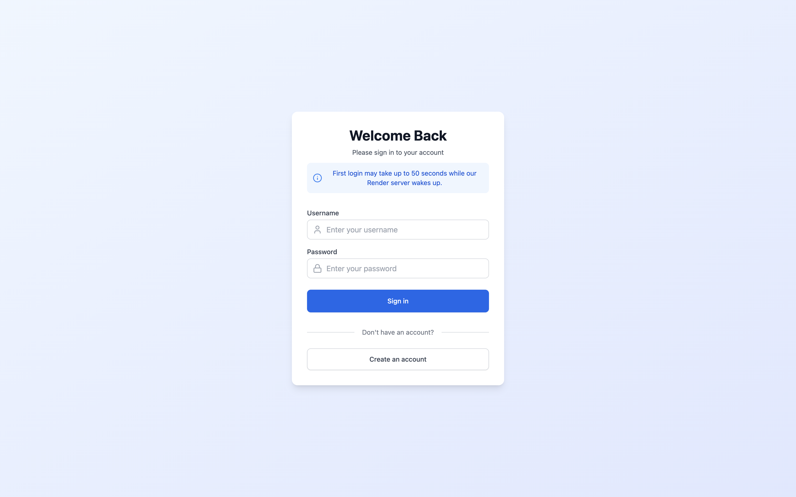

# TaskForce Wallet Web Application

A comprehensive web application for tracking personal finances across multiple accounts, built with React + Vite and integrated with a Spring Boot backend.





## 🚀 Live Demo

- Frontend: [TaskForce Wallet](https://taskforce-wallet.vercel.app)
- Backend API:
  - Primary: [Render](https://taskforce-wallet-bn.onrender.com)
  - Secondary: [AWS EC2](http://ec2-13-60-163-227.eu-north-1.compute.amazonaws.com)

## 🔑 Getting Started with the App

1. **Create an Account**
   - Visit [TaskForce Wallet](https://taskforce-wallet.vercel.app)
   - Click "Register" or "Sign Up"
   - Enter your desired username and password
   - Complete registration
2. **Log In**

   - Use your registered credentials to log in
   - Access your personalized dashboard

3. **Set Up Your Accounts**

   - Add your different financial accounts (bank, mobile money, cash)
   - Set initial balances
   - Customize account names and types

4. **Start Managing Your Finances**
   - Record transactions
   - Set budgets
   - Track expenses by category
   - View financial reports

## 💡 Key Features & Usage

### Account Management

- Add multiple accounts with different types (bank, mobile money, cash)
- View balance for each account
- Track account-specific transactions

### Transaction Tracking

- Record income and expenses
- Add transaction details (date, amount, category)
- View transaction history

### Budget Control

- Set monthly or custom period budgets
- Get notifications for budget limits
- Track budget vs. actual spending
- View budget performance reports

### Expense Categories

- Create custom categories and subcategories
- Organize transactions by category
- View spending patterns by category
- Edit or merge categories

### Reports & Analytics

- Generate detailed financial reports
- View spending trends
- Analyze income vs. expenses
- Export reports for personal records

## ✨ Features

- **Multi-Account Transaction Tracking**

  - Monitor transactions across various accounts (bank, mobile money, cash)
  - Real-time transaction updates and balance tracking

- **Budget Management**

  - Set spending limits with customizable thresholds
  - Receive notifications when approaching or exceeding budget limits

- **Expense Categorization**

  - Create and manage expense categories and subcategories
  - Link transactions to specific categories for better organization
  - Intuitive category management interface

- **Reporting & Analytics**

  - Generate detailed financial reports for any time period
  - Visualize spending patterns through interactive charts
  - Track spending trends across different categories

- **Secure Authentication**
  - User registration and login functionality
  - Protected routes and secure API integration

## 🛠️ Built With

- [React](https://reactjs.org/) - Frontend framework
- [Vite](https://vitejs.dev/) - Build tool
- [Tailwind CSS](https://tailwindcss.com/) - Styling
- [Spring Boot](https://spring.io/projects/spring-boot) - Backend API

## 📋 Prerequisites

Before running this project, make sure you have:

- Node.js (v14 or higher)
- npm or yarn package manager
- Git

## 🚀 Development Setup

1. **Clone the repository**

   ```bash
   git clone https://github.com/kirengamartial/Taskforce-wallet.git
   cd Taskforce-wallet
   ```

2. **Install dependencies**

   ```bash
   npm install
   # or
   yarn install
   ```

3. **Configure environment variables**
   Create a `.env` file in the root directory:

   ```env
   VITE_API_URL=Your_backend_url
   ```

4. **Start the development server**

   ```bash
   npm run dev
   # or
   yarn dev
   ```

5. **Build for production**
   ```bash
   npm run build
   # or
   yarn build
   ```

## 🔗 Related Repositories

- Backend Repository: [Taskforce-wallet-bn](https://github.com/kirengamartial/Taskforce-wallet-bn)

## 📱 Application Structure

```
src/
├── assets/         # Static assets
├── components/     # Reusable UI components
├── pages/          # Application pages
├── store           # State management
├── slices          # api request file are here
└── utils/          # Helper functions and utilities
```

## 🤝 Contributing

1. Fork the repository
2. Create your feature branch (`git checkout -b feature/AmazingFeature`)
3. Commit your changes (`git commit -m 'Add some AmazingFeature'`)
4. Push to the branch (`git push origin feature/AmazingFeature`)
5. Open a Pull Request

## 👨‍💻 Author

Martial Kirenga - [GitHub Profile](https://github.com/kirengamartial)
